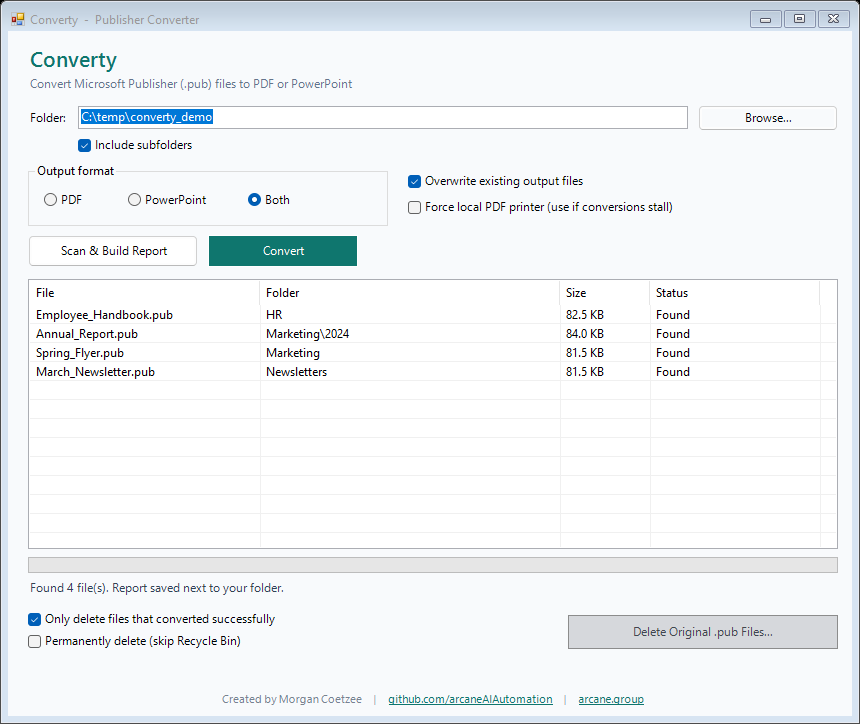

<h1 align="center">Converty</h1>

<p align="center">
  <b>Batch-convert Microsoft Publisher <code>.pub</code> files to PDF or PowerPoint — with a folder scan/report and a safe one-click cleanup of the originals.</b>
</p>

<p align="center">
  
  
  
  
</p>

<p align="center">
  
</p>

---

## Why Converty?

Microsoft Publisher files (`.pub`) are a closed, proprietary format that almost
nothing but Publisher itself can open. When an organisation moves away from
Publisher, it's left with folders full of `.pub` files that nobody can read.

**Converty** walks a folder tree, converts every `.pub` to a **PDF** and/or a
**PowerPoint** deck — writing each output right next to its source file — and can
then tidy up the originals once you're satisfied. It's a small, dependency-free
set of scripts: no install, no build step, nothing to compile.

## Features

- 📁 **Pick a folder, recurse subfolders** — one click scans the whole tree.
- 🔄 **Convert to PDF, PowerPoint, or both** — each file is written **into the
  same folder as its source** (`…\Brochure.pub` → `…\Brochure.pdf` / `.pptx`).
- 🔎 **Scan & report** — generates an HTML report (plus CSV and TXT) showing the
  exact location and folder structure of every `.pub` file found.
- 🧾 **Live per-file status** — watch each file go from *Found* → *PDF done* /
  *PPTX done*, or see exactly which file failed and why.
- 🗑️ **Elective cleanup** — optionally delete the originals afterwards. Defaults
  to the **Recycle Bin** and to deleting **only** files that converted
  successfully. The button stays disabled until you've actually converted.
- 🛡️ **Hang-proof batches** — a stall watchdog kills a frozen document and
  resumes with the rest, so one bad file never freezes the whole run.

## Requirements

| Need | Why |
|------|-----|
| Windows 10 / 11 | Uses built-in Windows PowerShell 5.1, `cscript`, and the Windows PDF renderer |
| Microsoft **Publisher** | The only reliable way to read the `.pub` format |
| Microsoft **PowerPoint** | Only required if you want PowerPoint output |

> Tested on Windows 11 with Microsoft 365 / Office 2016 (64-bit).

## Getting started

1. **Download** or clone this repository to a folder, e.g. `C:\Tools\Converty`.
2. **Run it** — double-click **`Converty.vbs`** (launches with no console window),
   or run **`Converty.cmd`**.

That's it — there is nothing to install.

> If Windows SmartScreen warns about the script the first time, choose
> *More info → Run anyway*. The source is right here for you to read.

## Usage

1. **Folder** — click *Browse…* and choose the folder that holds your Publisher
   files. Leave *Include subfolders* ticked to process the entire tree.
2. **Scan & Build Report** — finds every `.pub` and writes a timestamped report
   next to your folder (the HTML version opens automatically):
   - `Converty_Report_<timestamp>.html` — summary, folder tree, and file table
   - `Converty_Report_<timestamp>.csv` — open in Excel
   - `Converty_Report_<timestamp>.txt` — plain-text folder tree
3. **Output format** — choose **PDF**, **PowerPoint**, or **Both**.
4. **Convert** — each file is converted in place, next to its original. The list
   shows live status for every file.
5. **Delete Original .pub Files…** *(optional)* — once conversion has run, this
   button unlocks. It asks for confirmation, and by default moves files to the
   **Recycle Bin** and only removes ones that converted successfully.

### Options

| Option | Effect |
|--------|--------|
| **Include subfolders** | Walk the whole tree instead of just the chosen folder |
| **Overwrite existing output files** | Re-create outputs even if a `.pdf`/`.pptx` already exists (off = skip those) |
| **Force local PDF printer** | Temporarily switch the default printer to *Microsoft Print to PDF* during conversion — use only if conversions stall (see below) |
| **Only delete files that converted successfully** | Safety net for the delete button (on by default) |
| **Permanently delete (skip Recycle Bin)** | Hard-delete instead of recycling |

## What you get

```
Before                               After  (Output format = Both)
─────────────────────────            ─────────────────────────────────
Marketing\                           Marketing\
├─ Spring_Flyer.pub                  ├─ Spring_Flyer.pub
└─ 2024\                             ├─ Spring_Flyer.pdf
   └─ Annual_Report.pub              ├─ Spring_Flyer.pptx
HR\                                  └─ 2024\
└─ Employee_Handbook.pub                ├─ Annual_Report.pub
                                        ├─ Annual_Report.pdf
                                        └─ Annual_Report.pptx
                                     HR\
                                     ├─ Employee_Handbook.pub
                                     ├─ Employee_Handbook.pdf
                                     └─ Employee_Handbook.pptx
```

## How it works

- **PDF** is produced by Publisher's own export engine (`ExportAsFixedFormat`),
  so it's full native fidelity.
- **PowerPoint** is built page-by-page: Publisher can't emit images, so each
  page is exported to PDF, rasterised with the **built-in Windows PDF renderer**
  (`Windows.Data.Pdf`), and dropped full-bleed onto one slide per page.

Publisher and PowerPoint are automated through tiny **VBScript engines**
(`engine_publisher.vbs`, `engine_powerpoint.vbs`) run by `cscript`. This is
deliberate: driving Publisher's COM API directly from PowerShell deadlocks on
every save/export, because PowerShell's thread doesn't pump the Windows message
loop the way Office's synchronous file I/O requires. `cscript` is the canonical
Office automation host and handles it cleanly. A **stall watchdog** in the GUI
tails each engine's progress and, if a document hangs, kills it and resumes the
batch on the remaining files.

```
            ┌──────────────────────────── Converty.ps1 (WinForms GUI) ────────────────────────────┐
            │  Scan → Report      Convert orchestration + watchdog       Delete (Recycle Bin)       │
            └─────────────┬──────────────────────┬───────────────────────────────────┬─────────────┘
                          │                      │                                   │
                   Get-ChildItem        cscript engine_publisher.vbs        Windows.Data.Pdf
                   (file scan)          (.pub → PDF, full fidelity)         (PDF → page PNGs)
                                                 │                                   │
                                                 └────────────► cscript engine_powerpoint.vbs
                                                                (PNGs → one slide per page → .pptx)
```

## Troubleshooting

| Symptom | Fix |
|---------|-----|
| **Conversions hang / time out** | Often a slow or offline **default network printer** (Office reads page metrics from it). Tick **Force local PDF printer** and run again. |
| **"Cannot start Microsoft Publisher"** | Publisher isn't installed, or a stuck `MSPUB.exe` is running — end it in Task Manager and retry. |
| **PowerPoint output is missing** | PowerPoint isn't installed; PDF output still works. |
| **A single file fails** | The status column shows the reason; the rest of the batch continues. Reports and logs name the exact file. |
| **PowerPoint slides aren't editable text** | Expected — see *Limitations*. Use PDF if you need fidelity, PowerPoint if you need slides. |

## Limitations

- **PowerPoint output is one image per slide**, not editable text. Publisher
  exposes no way to export editable content or images via automation, so a deck
  is a faithful *picture* of each page. PDF output is fully native.
- Requires Publisher to be installed locally — there is no way to read `.pub`
  without it.

## Project structure

| File | Purpose |
|------|---------|
| `Converty.vbs` | Recommended launcher (no console window) |
| `Converty.cmd` | Alternative launcher |
| `Converty.ps1` | The GUI and all orchestration |
| `engine_publisher.vbs` | `.pub` → PDF, via Publisher under `cscript` |
| `engine_powerpoint.vbs` | page images → `.pptx`, via PowerPoint under `cscript` |
| `docs/screenshot.png` | Screenshot used in this README |

## Contributing

Issues and pull requests are welcome. The whole tool is plain PowerShell and
VBScript — open `Converty.ps1` and you can read it top to bottom.

## License

Released under the [MIT License](LICENSE). © 2026 Morgan Coetzee / Arcane Group.

## Author

**Morgan Coetzee**
GitHub: [github.com/arcaneAIAutomation](https://github.com/arcaneAIAutomation)
Website: [arcane.group](https://arcane.group)
